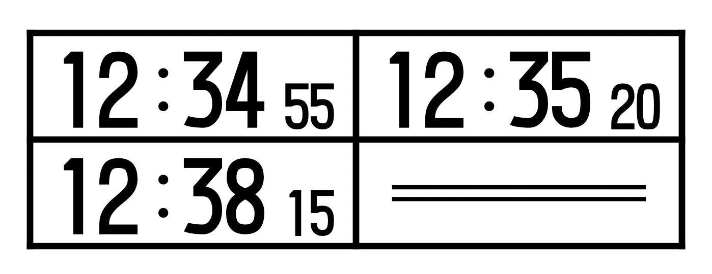

# XF_Nstf



This font is a compact font inspired by train schedule carring train crews.

## Included glyphs

This font only included 12 glyphs.

`0123456789:=`

## License

This font is licensed under the [SIL Open Font License 1.1](LICENSE).
Feel free to use it for personal or commercial projects.

## Repository Structure

- `XF_Nstf.sfdir/`: FontForge source directories (`.sfd`)

## Development / Building from Source

Requires [FontForge](https://fontforge.org/) installed on your system.

```bash
# Generate .otf, .ttf, and .woff2 into fonts/ directory
bash build.sh
```
